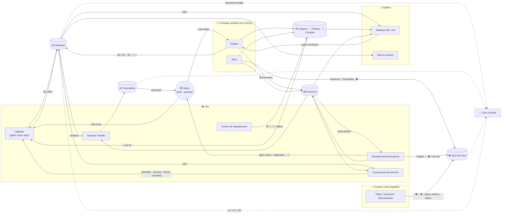

# 08 — Economía completa de NO ONE LIKE CATS (Capítulo 1: "El Primer Mar")

> **Qué es este documento.** La economía entera del Capítulo 1: monedas, de dónde salen y a dónde van, todas las fórmulas, las tablas de contenido y una **simulación** que la valida con 4 tipos de jugador.
> **Fuente de verdad:** `research/economy-sim/balance.json`. El simulador (`sim.py`) lee ese archivo tal cual. Las tablas de la sección 5 se generan desde el JSON con `tables.py`, así el documento y el juego nunca se separan.
> **Contexto usado:** `CHARLA.txt` completo, `02-dragon-city.md` (números de DC y propuestas), `06-juegos-progresivos.md` (matemática incremental y pacing) y `01-gatos-inventario.md` (los 32 SVG reales de gatos).

---

## 0. Resumen ejecutivo

**Monedas finales (5 + materiales):**

| Rol | Moneda | Escala |
|---|---|---|
| Principal | 🪙 **Doblones** (oro) | números grandes, crecimiento exponencial |
| Principal | 🐟 **Pescaditos** (comida) | números grandes |
| Principal | ⏳ **Ronroneo** (tiempo que ganas jugando y que acelera timers) | minutos, con tope |
| Principal | 🔮 **Orbes de Alma** (uno por especie de gato) + 🌈 Orbe Prisma (comodín raro) | números chicos |
| Combate (la isla NO los produce) | ⚙️ **Chatarra** · 📜 **Planos** · 💠 **Cristales de Elemento** | números chicos |
| Especial | 👁️ **Ojos de Gato** (gemas) | escasas, ~150 por capítulo, atadas al contenido |

**Las 6 ideas que sostienen todo:**
1. **Dos escalas de números.** El oro y la comida crecen exponencialmente (la fantasía "de 1 moneda a 50M por acción"). Los materiales, orbes y gemas se quedan en números chicos y son las **compuertas reales**. Así los números pueden explotar sin romper el balance.
2. **Todo premio activo se mide en "segundos de tu producción".** Una victoria vale `max(tabla de etapa, 40 s × oro/s)`, y una misión vale 60 s. Jugar nunca se vuelve irrelevante, sin importar la escala.
3. **El nivel de Reino da XP como % de la barra**, no en puntos absolutos. El ritmo de niveles no depende de cuántos ceros tenga el oro.
4. **El poder de cada jefe se fija contra el "presupuesto de poder"** que se puede alcanzar con el Mk máximo de esa zona. Por eso nunca hay muros imposibles (el primer intento de balance tenía uno, ver §6.6).
5. **Las gemas se ganan por contenido** (jefes, Catdex, hitos), no por tiempo jugado. El total del capítulo es casi igual para todos (~145–160), así que farmear no infla la economía.
6. **El Ronroneo es la palanca maestra de "espera o sigue jugando".** Es también la palanca más sensible del balance: ×0.5 → +35% de duración (§6.7).

**Resultado de la simulación (24 semillas por perfil):**

| Perfil | Termina el capítulo | Rango P10–P90 | Lo que muestra |
|---|---|---|---|
| **Activo normal** | **5 h 24 min** (mediana) | 5h01 – 5h47 | Dentro de la meta de 5–6 h |
| **Optimizador** | **3 h 32 min** | 3h10 – 3h48 | Dentro de 3–4 h (0.65× el normal) |
| **Casual que espera** (6 sesiones de 6 min al día, 2 combates por sesión) | **5 días y 6 h** de calendario | 4d15h – 5d12h | No termina en un día; avanza sin parar (Reino ~11 al cerrar el día 1, ~25–32 el día 2 y 50 durante el día 3) |
| **Idle puro** (mismas sesiones, 0 combates) | **Nunca** | — | Se estanca en Reino 8–9 sin pasar el Jefe 1: **esperar solo no alcanza** |

Oro/s del jugador normal: **1.1 → 3.3K (1 h) → 136K (3 h) → 1.7M (4h30) → 4.9M (final)**. El botín de una victoria pasa de **~40 oro** en el minuto 1 a **~100–150M** al final ("1 acción ≈ 50M" ✔).

**Archivos** (en `research/economy-sim/`): `balance.json` · `sim.py` · `tables.py` · `gambit_check.py` · `sensitivity.py` · `gold_curve.svg` · `out_*.csv` · `sim_output_seed3.txt` · `robustez_24_semillas.txt` · `sensitivity.txt` · `gambit_check.txt` · `tablas_generadas.md`.

---

## 1. Principios de diseño de la economía

| # | Principio | Cómo se implementa |
|---|---|---|
| P1 | **Nunca "espera o paga"; siempre "espera o sigue jugando"** | Todo timer productivo acepta Ronroneo. Ningún precio en dinero real. Las gemas también se ganan jugando |
| P2 | **Tiempo verde vs tiempo rojo** | Verde (productivo): cultivo, construcción, astillero, resonancia, eclosión, expedición, reparación → acelerable. Rojo (desafío): flash, heroicas, microeventos → **sagrado**, ni las gemas lo tocan (`events.rule`) |
| P3 | **Dos escalas** | Grandes: Doblones y Pescaditos. Chicas: Orbes, Chatarra, Planos, Cristales y Gemas. Las compuertas viven en la escala chica |
| P4 | **Recompensa indexada a la producción** | Victoria = 40 s de ingreso (mínimo: tabla de etapa). Misión = 60 s. Desborde de Ronroneo = 15 s de ingreso por minuto |
| P5 | **Siempre progreso aunque pierdas** | Derrota: 30% del oro y la chatarra, 0.4 min de Ronroneo, XP, +20% de **Análisis del jefe** (+5% de poder contra él, hasta +25%) |
| P6 | **La rareza paga en economía, no en fuerza bruta** | Oro base: Común 0.5 → Mítico 3.2 (×6.4). Poder base: 5.0 → 7.4 (solo ×1.48). La rareza da **mecánicas** (CHARLA) |
| P7 | **El barco consume la misma economía** | Medido: **48–55% de todo el oro gastado va al barco** (módulos y barcos). La isla no produce Chatarra, Planos ni Cristales |
| P8 | **Automatizar lo viejo, dar problemas nuevos** | 12 automatizaciones por nivel de Reino (§5.9) |
| P9 | **Extensible por filas, no por fórmulas** | Un update agrega filas a las tablas (elementos, Catdex, zonas, cultivos, tiers, barcos, expansiones) y sube el tope de nivel; las fórmulas no cambian (§8) |
| P10 | **Ningún timer productivo nominal supera 45 min** (02 y 06) | La única excepción es el Banquete del Leviatán (6 h), un cultivo **opcional** pensado para la noche |

---

## 2. Monedas y recursos finales

### 2.1 Tabla maestra

| Moneda | Icono sugerido | Para qué sirve | Fuentes (grifos) | Sumideros (desagües) | Tope | Alcance | Por qué existe |
|---|---|---|---|---|---|---|---|
| 🪙 **Doblones** (`gold`) | Moneda dorada con huella de gato y bigotes grabados | Construir y mejorar hábitats, sembrar, mejorar granjas, comprar expansiones, módulos y barcos, apostar | **Hábitats** (~72% en el normal), **batallas** (~17%), **misiones** (~11%), desborde de Ronroneo y Gambit | Barco: módulos (~48%) y barcos nuevos (~7%) · Expansiones (~19%) · Hábitats (~10–23%) · Cultivos (1–12%) · Granjas (~1%) | Billetera sin tope. Cada hábitat tiene un **búfer** (30–120 min de su producción) | Global | La moneda "Dragon City": el número que explota. Es lo que hace que 10,000 se sienta como una fortuna y luego como nada |
| 🐟 **Pescaditos** (`food`) | Pez plateado que salta | Alimentar gatos (nivel = oro + poder) | Granjas y cultivos (se compran con oro), misiones, eventos ("Migración del Leviatán" ×15), Gambit | Alimentar | Sin tope (no se pudre) | Global | El puente oro → gato. Que la comida cueste oro (como en DC) crea la decisión entre crecer la isla o crecer el gato |
| ⏳ **Ronroneo** (`purr`) | Reloj de arena con bigotes y una cola de gato | Acelerar **cualquier** timer productivo. Por defecto se aplica solo al timer más cercano a terminar; el jugador puede fijar otro | **Jugar**: victoria, perfecta, núcleo destruido, derrota, jefe, especie nueva, misión, nivel de Reino, evento flash, set de Catdex | Timers verdes. El desborde se convierte en oro | **Sí**: `(20 + 3·Reino) min` (+50% con gemas). Lo que sobra → 15 s de oro por minuto | Global | Unifica "energía de resonancia", "fertilizante", "mano de obra" e "impulso de taller" de la CHARLA en **una** moneda con **bono de afinidad** (+50% si la fuente combina con el timer). Variedad sin 5 monedas |
| 🔮 **Orbes de Alma** (`orbs`) | Esfera con la silueta del gato dentro | Subir estrellas (1★ → 6★); cada estrella agrega una mecánica | **Duplicados** de Resonancia, victorias (35% de chance de 3 orbes de un gato "estudiado"), jefes (25), misiones (5), expediciones (6/h) y Prisma | Estrellas | Sin tope | **Por especie** | El "orbe por dragón" de DC: los duplicados nunca decepcionan ("me faltaban 35") |
| 🌈 **Orbe Prisma** (`prisma`) | Esfera arcoíris | Comodín: 1 Prisma = 1 Orbe de Alma de cualquier especie | Sets del Catdex (10), Mina del Arrecife Prismático (6/h), gemas (2 c/u, máx. 10 por jefe) | Estrellas | — | Global | Válvula anti-mala-suerte para los gatos que más usas |
| ⚙️ **Chatarra** (`scrap`) | Tuerca con cascabel | Mk de los módulos del barco | **Solo combate**: `(2 + 0.5·etapa)` por victoria (×1.5 si es perfecta, ×1.4 con Merodeador), ~8 módulos destruidos por batalla. Expediciones | Módulos | — | Global | Vincula el barco con el combate: la isla no puede comprarla |
| 📜 **Planos** (`blueprint`) | Pergamino azul con huella | Desbloquear Mk III a Mk VII | 35% por victoria desde la etapa 3, en cantidad `1 + ⌊(zona−1)/2⌋`. Jefes: 8. Expediciones | Módulos (1/2/3/4/5 por Mk) | — | Global | Ancla el poder del barco a **avanzar zonas**: el Mk máximo es `jefes + 2` |
| 💠 **Cristales de Elemento** (`crystal`) | Cristal del color del elemento | Armas, Escudos y Núcleo Mk V+; hábitats tier 5+ **de ese elemento** | Victorias `1 + 0.75·zona` del elemento enemigo, jefes (12), eventos flash, expediciones | Módulos y hábitats altos | — | **Por elemento** | Une isla ↔ combate: para el Santuario Arcano de Fuego hay que pelear contra barcos de Fuego. Cada elemento nuevo trae su cristal (extensible) |
| 👁️ **Ojos de Gato** (`gems`) | Gema verde y dorada con pupila felina rasgada | Comodidades permanentes, saltar timers verdes, Prisma, cosméticos, Gambit | Jefes (6; el final, 15), Catdex (1/1/2/2/3 por rareza), hitos de Reino cada 5 niveles (2), misiones (15%), perfectas (5%), heroicas (5), flash (1), secretos, Gambit (limitado) | §4.15 | — | Global | La moneda especial **escasa** que nunca bloquea: todo lo que compra se puede conseguir también jugando |

**No son monedas** (son barras o estados; no se gastan): XP de Reino, Momentum, Análisis del jefe y cargas del Gambit.

### 2.2 Lo que se eliminó y por qué

| Propuesta (CHARLA o investigación) | Decisión | Motivo |
|---|---|---|
| Esencia (invocaciones y evolución) | ❌ Fusionada | La Resonancia solo cuesta tiempo (como en DC). La "evolución" ya la hacen las estrellas con orbes. Una moneda más no agregaba decisiones |
| Fragmentos (rarezas y reliquias) | ❌ Fusionada en Orbes, Prisma y Planos | Tres cosas parecidas confunden. Los orbes cubren "gato específico" y los planos cubren "pieza específica" |
| Madera ancestral y piezas mecánicas | ❌ Fusionadas en **Chatarra** | Dos materiales genéricos de barco no se distinguen en las decisiones |
| Esencia primordial | ❌ Ahora es un **objeto de historia** (no se acumula) | La da un jefe para descubrir un elemento. No hace falta que sea moneda |
| Energía de Resonancia, fertilizante, mano de obra, conocimiento e impulso de taller | ❌ Unificadas en **Ronroneo + bono de afinidad** | Misma función (restar tiempo). La variedad que pide la CHARLA se conserva con el +50% por afinidad (combate → astillero, cosecha → granjas, descubrimiento → resonancia, misiones → construcción) |
| Moneda meta / prestigio (Runas, Polvo astral, Legado) | ⏸️ **Diferida a post-capítulo** | 06 concluye que un prestigio duro dentro de un arco de 6 h se siente como relleno. Queda el NG+ **"Ecos de Marea"** = `⌊√(oro_vida / 10¹⁰)⌋`, +5% de producción por Eco. El normal genera ~1.4·10¹⁰ de oro → ~1 Eco. Se calibra con el Cap. 2 |
| Monedas de evento (polvo cósmico, conchas) | ⚠️ Solo **dentro** del evento | Son contadores temporales del evento (como "100 de Polvo Cósmico") y desaparecen al terminar. Nunca entran a la billetera |
| Energía o stamina | 🚫 Prohibida | Regla del usuario |

---

## 3. Diagrama de flujo (grifos → desagües)



**Versión en texto (el círculo de la CHARLA con sus monedas):**

```
🌾 Granjas ──🐟──► 🐱 Gatos ──(nivel)──► 🏠 Hábitats ──🪙──┐
   ▲   (siembra cuesta 🪙)     │                              │
   │                          (poder)                         ▼
   └──────────🪙──────────── ⚔️ Batallas ◄──── 🚢 Barco ◄── 🪙 + ⚙️📜💠
                               │   │                           ▲
                    ⚙️📜💠🔮⏳◄─┘   └─► 👑 Jefes ─► elemento nuevo ─► ✨ Resonancias ─► 🐱🐱🐱 ─► +2% oro (Catdex)
⏳ Ronroneo: todo lo que haces jugando resta tiempo a lo que esperas.
```

---

## 4. Fórmulas (con parámetros de `balance.json`)

### 4.1 Notación de números (`notation`)

```
n < 10,000                → completo con separadores: 9,999
n ≥ 10,000                → 3 cifras significativas + sufijo: 12.3K · 4.70M · 48.0B
sufijos: K, M, B, T, Qa, Qi, Sx, Sp, Oc, No, Dc → después aa, ab, ac… (estilo idle)
```

- Agregar un *tooltip* con el número completo y una nota regional: **"B = mil millones"** (en español, "billón" es 10¹²; ver 06 §2.8).
- El Cap. 1 termina en el rango **B**: el normal gana ~1.4·10¹⁰ de oro en total y la cifra más grande que ve es ~2·10¹² (la billetera del casual). Un *double* alcanza sin problema (es exacto hasta 9·10¹⁵). Para el clímax, 06 propone un efecto **visual** de "1.00aa → glitch ???" ligado al Vacío. Sugiero mostrarlo como animación, sin pasar esos números por la economía.

### 4.2 Producción de un hábitat

```
oro/s(gato)      = G_r · 1.16^(nivel−1) · Estrella[★]
oro/s(hábitat)   = Σ oro/s(gatos dentro) · Mult_tier · (1 + 0.25·banqueros_en_él)
oro/s(isla)      = Σ hábitats · (1 + (0.02 + bonoCatdex)·especies) · (1 + Σ bonos_expansión) · (1 + 0.5·(Momentum−1))
búfer(hábitat)   = oro/s(hábitat) · búfer_min(tier) · 60        (offline sin Banco: lo que no cabe se pierde)
Banco del Reino  = (Reino 15) deposita solo; offline guarda hasta 2 h (+2 h con el Puerto de las Mareas)
```

| Parámetro | Valor |
|---|---|
| `G_r` (oro base/s) | Común 0.5 · Raro 0.8 · Épico 1.3 · Legendario 2.1 · Mítico 3.2 |
| Crecimiento por nivel | ×1.16 (nivel 50 = ×1,440) |
| Estrellas (1★ → 6★) | ×1.0 / 1.25 / 1.55 / 1.9 / 2.3 / 2.8 |
| Tier de hábitat | ×1 / 1.6 / 2.6 / 4.2 / 7 / 11 / 18 / 30 (§5.2) |
| Catdex | +2% por especie descubierta (+3% con el Arrecife Prismático) |
| Regla de elemento | Un gato solo vive en un hábitat de **uno de sus elementos**. Los híbridos eligen |

### 4.3 Comida: cultivos y costo por nivel

```
comida(cosecha)       = Comida_cultivo · 1.3^(nivel_granja−1) · (1 + bonos_comida + 0.20·granjeros)
tiempo_real           = tiempo_cultivo / (1 + 0.5·(Momentum−1))     (jugar acelera la pesca)
comida(nivel → nivel+1) = 6 · 1.27^(nivel−1) · F_r      F_r = 1.0 / 1.25 / 1.6 / 2.0 / 2.4 por rareza
tope de nivel del gato = min(50, Reino + 5)
```

- El costo de comida crece ×1.27 por nivel y el oro del gato, ×1.16. Cada nivel rinde un poco menos que el anterior. Eso empuja a **repartir la comida** entre muchos gatos (que es justo lo que hace un buen jugador de DC) y vuelve valiosos los gatos nuevos.
- En la interfaz, cada nivel se divide en **4 "ÑAM"** (02 §15.3-D). El simulador lo trata como un solo costo.
- El tope de nivel ligado al Reino evita la estrategia dominante de subir un solo gato a 50.

### 4.4 Construcción y mejoras (costo base × r^n)

```
Nuevo hábitat (n-ésimo)     = 60 · 4.2^(n−1)                 (el tope lo ponen las parcelas)
Subir de tier un hábitat    = tabla §5.2 (×~16–18 por tier) + Cristales en tier 5+
Mejorar granja a nivel L    = 150 · 3.0^(L−2)                 tiempo = 20 s · 1.45^(L−2), nivel máx. 15
Módulo f a Mk n             = costo_base_f · 16^(n−1)          base: Casco 80 · Arma 60 · Escudo 100 · Motor 70 · Núcleo 120
Poder de un módulo          = poder_f · 1.75^(Mk−1)            poder: Casco 15 · Arma 10 · Escudo 9 · Motor 7 · Núcleo 14
Mk máximo                   = jefes_derrotados + 2             (Zona 1 → Mk II … Zona 6 → Mk VII)
```

Los módulos se mejoran **por familia**, no por barco. Un "Cañón Mk V" sirve en cualquier barco, así cambiar de barco es gratis y tener varios barcos no multiplica el gasto.

### 4.5 Expansiones de terreno

```
costo(k) ≈ 20–30 min del ingreso esperado del jugador normal al llegar a su nivel de Reino
```

8 expansiones (§5.3) con costos de 400 → 7K → 120K → 2M → 35M → 200M → 400M → 1.5B. Ninguna es "solo más cuadritos": cada una abre parcelas **y** una mecánica (constructor, ranura de Resonancia, expediciones, Banco offline, mina de Prisma…). El jugador ahorra para ellas: el agente simulado espera hasta 6× su horizonte normal de ahorro, porque una expansión es una meta, no una compra impulsiva.

### 4.6 Combate: poder del barco, del enemigo y probabilidad de ganar

```
SP (poder del barco) = mult_barco · ( Σ_ranuras poder_f · 1.75^(Mk_f−1)  +  Σ_tripulación poder_gato ) · (1 + rasgo situacional)
poder_gato           = P_r · 1.07^(nivel−1) · Estrella[★]          P_r = 5.0 / 5.6 / 6.2 / 6.8 / 7.4
EP (poder enemigo)   = etapa k (1..8) de la zona z:  stage1_z · (jefe_z / 1.3 / stage1_z)^((k−1)/7)
                       etapa 9 = jefe_z / (1 + 0.25·Análisis)      Análisis sube 20% por derrota contra ese jefe
P(victoria)          = clamp( 0.5 + 0.5·tanh(1.6·ln(SP/EP)) + habilidad , 0.03 , 0.97 )
P(perfecta | victoria) = clamp( 0.2 + 0.6·(P−0.5) + habilidad_perfecta , 0 , 0.9 )
```

- Con SP = EP la probabilidad es 50%; con SP = 1.5·EP, 79%; con SP = 2·EP, 91%. Es una curva suave: siempre hay probabilidad, nunca hay certeza.
- **Rasgos situacionales** (06: "muchos barcos buenos para cosas diferentes"): Bastión +10% contra jefes; Bajel Arcano +20% contra Magia y Cósmico; Merodeador +40% de chatarra.
- **Presupuesto de poder:** el SP máximo teórico del capítulo (Mk VII completo, 7 gatos nivel 50 con 4–5★) es de ~8–9K. El jefe final (7.7K, o 6.2K con Análisis al 100%) queda al 70–90% de ese techo.

> **Nota sobre la física.** El combate real es habilidad (ángulo, potencia, destrucción física). La fórmula `P(victoria)` modela el **promedio** de un jugador para balancear la economía. En el juego, SP/EP debe sentirse como una ventaja (más HP, más daño, más módulos), no como una tirada de dado.

### 4.7 Recompensas de batalla (escalan con el progreso)

```
oro        = max( 15 · 1.30^(etapa−1) ,  40 s · oro/s_pasivo ) · (1 si es la etapa frontera; 0.7 si es una etapa ya ganada)
             · 1.5 si es perfecta · Momentum · (1.5 durante un evento flash)
derrota    = 30% del oro y la chatarra
chatarra   = (2 + 0.5·etapa) · perfecta(1.5) · Momentum · (1.4 con Merodeador)
           → por módulo destruido ≈ (2 + 0.5·etapa) / 8     (≈0.3 por pieza en la etapa 1; ≈3.6 en la etapa 54)
planos     = 35% de chance (etapa ≥ 3) de 1 + ⌊(zona−1)/2⌋ ;  jefe: 8
cristales  = 1 + 0.75·zona del elemento enemigo (×1.5 con Bajel) ;  jefe: 12
orbes      = 35% de chance de 3 orbes de un gato "estudiado" ;  jefe: 25 al mejor gato
gemas      = 5% por victoria perfecta ;  jefe: 6 (final: 15)
```

**Valor de "una acción"** en el jugador normal (semilla 3, cercana a la mediana):

| Momento | Oro/s | Botín de una victoria | ¿Cuántos segundos de ingreso? |
|---|---|---|---|
| Minuto 1 | 1.1 | ~44 | 40 s (la tabla de la etapa manda) |
| 0h30 | 879 | 52K | ~60 s (con Momentum ×2.6) |
| 1h00 | 3.3K | 201K | ~60 s |
| 2h00 | 35K | 1.3M | ~36 s |
| 3h00 | 136K | 7.2M | ~53 s |
| 4h30 | 1.7M | 84M | ~50 s |
| Final (5h22) | 4.9M | **116M** | ~24 s (el oro/s acaba de saltar al vencer al jefe) |

### 4.8 Tiempos de los timers (nominales)

| Sistema | Inicio | Medio | Final del Cap. 1 | Fórmula |
|---|---|---|---|---|
| Cultivo | 30 s | 5–25 min | 45–60 min (Leviatán: 6 h opcional) | Tabla §5.1. Momentum los acelera |
| Resonancia + eclosión | 3 min (Común) | 10 min (Raro) | 30 min (Épico) · 45 min (Legendario) | Por rareza del resultado (la duración **delata** la rareza, como el corazón dorado de DC). Eclosión = 35% del total |
| Construir o mejorar hábitat | 10 s | 1.5–8 min | 15–45 min | Tabla §5.2. Constructores −20% c/u (máx. 2) |
| Astillero (Mk) | 20 s | 2–5 min | 11–25 min | Tabla §5.4 |
| Expansión (limpieza) | 30 s | 2–7 min | 12–30 min | Tabla §5.3 |
| Expedición | 15 min | 1 h | 4 h | Elección del jugador (rinde `h^0.85`, así que lo corto rinde más por hora) |

**Medido:** el normal "salta" con Ronroneo el **50%** del tiempo nominal de sus timers y el optimizador el **63%** (06 pedía que, jugando, el tiempo efectivo fuera 30–50% del nominal ✔). El casual salta solo el 5%.

**Primera Resonancia del tutorial** (02 §15.6): Canelo + Brote con resultado garantizado (Pimentón o Chispa) en 90 s.

### 4.9 Ronroneo: cuánto vale cada acción

```
minutos = base · (1 + 0.05·(Reino−1)) · (1 + 0.5·(Momentum−1)) · (1.5 si es afín al timer)
pool máximo = (20 + 3·Reino) min  (×1.5 con la mejora de 30 gemas) → lo que sobra = 15 s de oro/s por minuto
```

| Acción | Base (min) | En Reino 20, Momentum ×1.5 | En Reino 40, Momentum ×2 |
|---|---|---|---|
| Victoria | 1.0 | 2.4 | 4.4 |
| + Perfecta | +0.75 | +1.8 | +3.3 |
| + Núcleo destruido | +0.25 | +0.6 | +1.1 |
| Derrota | 0.4 | 1.0 | 1.8 |
| Jefe | 10 | 24 | 44 |
| Especie nueva | 2.5 | 6.1 | 11 |
| Misión | 0.75 | 1.8 | 3.3 |
| Subir de nivel de Reino | 2.5 | 6.1 | 11 |
| Evento flash completado | 2 | 4.9 | 8.9 |
| Set de Catdex | 5 | 12 | 22 |

- Una victoria típica a mitad del capítulo da **~3–5 min de Ronroneo por ~2.5 min de juego**. Medido: el normal genera **~258 min por hora** de juego (≈4.3 min por minuto) y el optimizador, ~440 min/h. Como el Ronroneo se aplica **a un timer a la vez** y hay 8–15 timers en paralelo, el efecto real es ~×2 en el cuello de botella, no ×4 en todo.
- **Afinidad** (+50%): combate → astillero y reparación · cosecha → granjas · descubrimiento → resonancia · misiones → construcción. *(No está simulado; da algo de margen extra.)*

### 4.10 Momentum

```
M ∈ [1, 3].  Cada evento suma:  victoria +0.10 · perfecta +0.08 · derrota +0.03 · jefe +0.6 · especie nueva +0.12 · misión +0.04 · cosecha +0.01
Decaimiento continuo:  M ← 1 + (M−1) · 0.5^(dt / 300 s)     (vida media de 5 min; nunca baja de 1)
Efectos:  botín de batalla ×M · oro de hábitats ×(1+0.5·(M−1)) · velocidad de cultivo ×(1+0.5·(M−1)) · Ronroneo ×(1+0.5·(M−1))
```

Medido: el normal juega entre **×1.3 y ×2.6**; el optimizador, entre ×1.4 y ×2.5; el casual se queda en ×1.0. **No castiga**: cerrar el juego solo deja que se enfríe.

### 4.11 Nivel de Reino (XP como % de la barra)

```
XP ganada = pct_de_barra · (1 + 1.0·max(0, 1 − (Reino−1)/10)) / (1 + 0.03·(Reino−1))
             ↑ impulso de tutorial (×2 en Reino 1, desaparece en Reino 11)   ↑ "arrastre" que alarga los niveles altos
barra visible = 100 · 1.25^(Reino−1) XP   (cosmético: las recompensas son % de esta barra)
```

| Acción | % de barra | Acción | % de barra |
|---|---|---|---|
| Construcción terminada | 5% (+1% por tier) | Nivel de gato | 0.8% |
| Mejora de barco | 8% | Estrella | 6% |
| Eclosión C/R/É/L/M | 3/5/10/18/25% | Especie nueva | 8% |
| Victoria (+ perfecta) | 6% (+2%) | Derrota | 2% |
| Jefe | 60% | Expansión | 50% |
| Misión | 6% | — | — |

Medido en el normal: alimentar 24% · construir 16% · resonancia 14% · combate 9% · misiones 9% · expansión 7% · estrellas 7% · descubrir 6% · jefes 5% · barco 4%. **Reino 10 ≈ 0h25, 20 ≈ 1h11, 30 ≈ 2h54, 40 ≈ 4h31; fin en Reino ~43.** Los niveles 44–50 quedan como post-capítulo.

### 4.12 Orbes y estrellas (1★ → 6★)

```
orbes(★s → ★s+1) = Base_r · [1, 2, 3, 5, 8][s−1]        Base_r = 10 / 15 / 25 / 40 / 60
requisito de nivel para 2★…6★ = 10 / 20 / 30 / 40 / 50
duplicado = 10 / 20 / 35 / 60 / 100 orbes por rareza
```

En total, un Común necesita 190 orbes para 6★; un Legendario, 760; un Mítico, 1,140 (tabla en §5.6). Es la progresión de DC (120/200/320/560/800) a ~1/10 de escala, adecuada para 4–8 h (02 §15.3-F). Medido: al final, los gatos de la tripulación del normal tienen **4–5★**. **6★ (Forma Ascendida, nivel 50)** queda como meta post-capítulo.

### 4.13 Resonancia: probabilidades visibles

```
U = elementos(padre A) ∪ elementos(padre B)        (solo elementos ya descubiertos)
Buckets y peso:   Común 55 · Raro 30 · Épico 11 · Legendario 3.5 · Secreto 0.5
   + 2 de peso Épico y +0.5 Legendario por cada rango de rareza de los padres (Común = 0 … Mítico = 4)
   + pity: +1 de peso Épico por cada resonancia sin Épico o mejor (máx. +15; se reinicia)
Candidatos:  Comunes con elemento ∈ U · Raros/Épicos cuyo par ⊆ U (Épico: ambos padres ≥ nv15)
             Legendario (Primordial) del elemento que comparten ambos padres (ambos ≥ nv20)
             Secreto "???": un Épico o Legendario aún no descubierto cuyos elementos ya conoces
El peso de cada bucket se reparte entre sus candidatos; los buckets vacíos se redistribuyen.
```

Ejemplos reales (generados con `tables.py`):

| Padres | Común | Raro | Épico | Legendario | ??? |
|---|---|---|---|---|---|
| Canelo (Fuego) nv1 + Gelatino (Agua) nv1 | 64.3% (4 gatos de 16.1%) | 35.1% (Neblino) | — | — | 0.6% |
| Los mismos en nv18 | 57.0% | 31.1% | **11.4% (Vapor Ronin)** | — | 0.5% |
| Neblino (Fuego/Agua) nv22 + Canelo nv22 | 53.7% | 29.3% | 12.7% | **3.9% (Ignis)** | 0.5% |
| Solar (Fuego/Cósmico) nv25 + Astral (Magia/Cósmico) nv25 | 61.1% (6 gatos) | 33.3% (3 gatos) | — | **5.0% (Astra Prima)** | 0.6% |

Mejoras sugeridas por 02 que el JSON acepta sin cambiar fórmulas: +1% Épico por estrella de cada padre (como la "barra verde" de DC), portal dorado si el resultado es Épico o mejor, e híbridos de **elementos opuestos** que exigen padres híbridos.

### 4.14 Duplicados → orbes

Un duplicado **nunca es pérdida**: se convierte en Orbes de Alma de esa especie (10/20/35/60/100) y además da XP de eclosión. La pantalla de resultado muestra la barra de estrella llenándose ("¡85/120 Orbes Solares!").

### 4.15 Gemas (Ojos de Gato): fuentes, tasa y sumideros

**Medido (semilla 3):**

| Fuente | Normal | Optimizador | Casual (5 días) |
|---|---|---|---|
| Catdex (especies nuevas) | 64 | 61 | 59 |
| Jefes | 45 | 45 | 45 |
| Hitos de Reino | 16 | 16 | 20 |
| Eventos (flash y heroicas) | 17 | 19 | 0 (se los pierde) |
| Misiones | 13 | 12 | 18 |
| Perfectas y Gambit | 2 | 8 | 2 |
| **Total** | **157 (29/h)** | **161 (46/h)** | **144 (1.1/h de calendario)** |

**Tasa objetivo:** ~150 gemas por capítulo (casi todas atadas al contenido); ~25–30/h para el normal.

| Sumidero | Costo | Límite | Por qué no rompe nada |
|---|---|---|---|
| Ranura extra de Resonancia | 40 | 1 | Las ranuras 2 y 3 también llegan gratis con expansiones |
| Constructor extra | 50 | 1 | El 2.º constructor llega gratis con el Acantilado |
| Reloj de arena grande (+50% del pool de Ronroneo) | 30 | 1 | Solo amplía el tope, no genera tiempo |
| Orbe Prisma | 2 | 10 por jefe | Válvula contra la mala suerte |
| Saltar un timer **verde** | 1 gema = `2 min · (1 + 0.05·(Reino−1))` | Máx. 10 gemas por timer. **Nunca** en timers rojos | Con ~150 gemas en total, es un lujo puntual |
| Cosméticos (auras, skins de barco) | 20–80 | — | El sumidero sin fin que absorbe excedentes |
| Gambit | ≤ 3 por apuesta | 1 apuesta de gemas cada 2 niveles de Reino | EV acotado (§4.16) |

Medido: el normal gasta ~106 y termina con ~50 (para cosméticos). No hay acumulación peligrosa porque las gemas **no crecen con el tiempo jugado**.

### 4.16 Cat's Gambit (lotería) y sus límites

```
Tabla del usuario:  ×2 al 60% (EV 1.20) · ×5 al 22% (EV 1.10) · ×20 al 6% (EV 1.20)
Gato Maneki (Suerte):  +3 / +2 / +1 pp → EV 1.26 / 1.20 / 1.40
Gato del Caos:  reemplaza la tabla por ×50 al 2.5% (EV 1.25, todo o nada)

Cargas:   1 carga cada 3 victorias, máx. 5 guardadas   (jugar llena la mesa; no hay cooldown de calendario)
Apuesta máxima = min( 180 s · oro/s_pasivo ,  25% de la billetera ,  600 s · oro/s / multiplicador )
                   ↑ tope por ingreso          ↑ tope por cartera     ↑ un solo premio nunca supera 10 min de producción
Comida: igual con 180 s de comida/s.   Gemas: máx. 3 por apuesta y 1 apuesta de gemas cada 2 niveles de Reino.
Solo se apuesta oro, comida y gemas. Nunca chatarra, planos, orbes ni Ronroneo.
```

**Medido** (`gambit_check.py`, 24 semillas): oro neto del Gambit sobre el oro no-Gambit → normal **+2.3%** (−1.4% a +10.7%) · optimizador **+3.0%** (−3.5% a +12.2%) · "ludópata" que apuesta el máximo a ×20 en cada carga **+1.6%** (−3.2% a +19.2%), y **termina más tarde** que el optimizador sensato (3.63 h contra 3.55 h). El EV es positivo (es un premio por jugar), pero los topes atados al ingreso lo dejan en ruido. **No es la estrategia óptima** ✔.

### 4.17 Misiones de progreso (sin diarias)

Cada nivel de Reino abre ~2 misiones de cadena (Capitán, Criador, Explorador…): enseñan algo, abren algo o avanzan la historia. Recompensa: 60 s de oro, 60 s de comida, 0.75 min base de Ronroneo, 5 orbes, 15% de chance de 1 gema y 6% de barra. Son ~90 en el capítulo y se pueden agregar más en cada update (cadenas nuevas después de las anteriores).

### 4.18 Gatos trabajadores (Reino 24)

| Rol | Efecto | Máx. |
|---|---|---|
| Banquero | +25% de oro del hábitat donde vive | 4 |
| Granjero | +20% de comida global | 3 |
| Constructor | −20% de tiempo de construcción | 2 |
| Viajero | +50% de botín de expedición | 2 |

El trabajador **sigue produciendo** en su hábitat, pero **no puede subir al barco** mientras trabaja. ~1 de cada 3 especies tiene un rol (columna en §5.8).

### 4.19 Expediciones (Puerto de las Mareas)

```
botín = h^0.85 · (1 + 0.5·viajeros) · { chatarra (5 + 1.5·zona)/h · cristales 2/h · orbes 6/h · planos 0.25/h }
```

Dos ranuras. Es el canal **offline** de materiales: lo que permite que el casual avance el barco sin jugar mucho.

### 4.20 Eventos (reloj rojo, sagrado)

| Tipo | Disparo | Duración | Reto | Premio |
|---|---|---|---|---|
| Flash | Cada 2 niveles de Reino desde el 5, **solo si estás jugando** | 8 min | 3 combates (botín ×1.5 durante el evento) | 1 gema, 6 cristales, 2 min de Ronroneo |
| Heroica 1: "El Heredero del Trueno" | Reino 14 (el jugador elige cuándo empezar) | 25 min | 5 victorias + nodos (02 §15.4) | **Raijin** (Mítico) + 5 gemas |
| Bandera Negra | Reino 15 | 20 min | 5 victorias | Barco **Merodeador** gratis (si no, cuesta 600K en el astillero) |
| Heroica 2: "Grieta Cósmica" | Reino 37 | 25 min | 5 victorias + nodos | **Singularidad** (Mítico) + 5 gemas |
| Microeventos (pez dorado, gato fugitivo) | Cada 6–10 min de juego | 30 s – 3 min | Toque o minibatalla | 30–60 s de oro o 5–10 min de comida |

---

## 5. Tablas concretas del Capítulo 1

### 5.1 Cultivos (8)

| # | Cultivo | Reino | Tiempo | Costo (oro) | Comida | Comida/min (granja nv1) | Comida/min (granja nv15) | Comida por oro |
|---|---|---|---|---|---|---|---|---|
| 1 | Sardinas Diminutas | 1 | 30 s | 5 | 12 | 24 | 945 | 2.40 |
| 2 | Anchoas Saltarinas | 4 | 2 min | 70 | 80 | 40 | 1,575 | 1.14 |
| 3 | Banco de Caballa | 9 | 5 min | 900 | 520 | 104 | 4,095 | 0.58 |
| 4 | Salmón Imperial | 15 | 12 min | 13.0K | 3,400 | 283 | 11.2K | 0.26 |
| 5 | Pulpo Glaseado | 21 | 25 min | 200K | 22.0K | 880 | 34.6K | 0.11 |
| 6 | Pez Linterna Abisal | 28 | 45 min | 3.00M | 140K | 3,111 | 122K | 0.05 |
| 7 | Banquete del Leviatán *(nocturno, opcional)* | 33 | 6 h | 60.0M | 2.40M | 6,667 | 262K | 0.04 |
| 8 | **Atún de Nebulosa** | 36 | 1 h | 600M | 5.50M | 91.7K | 3.61M | 0.01 |

**Granjas:** nivel 1 → 15, rendimiento ×1.3 por nivel (×39 en el nivel 15). Mejoras: nv3 = 450, nv5 = 4K, nv8 = 109K, nv10 = 984K, nv12 = 8.9M, nv15 = 239M. Parcelas de granja: 2 al inicio y +7 con expansiones.
Idea de 02 que se puede sumar sin filas nuevas: **"red rápida"** (1/3 del tiempo y 45% de la comida) contra **"red normal"**, para tener un dilema activo/pasivo dentro de cada cultivo.

### 5.2 Hábitats (8 tiers)

| Tier | Hábitat | Reino | Capacidad | Mult. oro | Búfer offline | Costo (oro) | Cristales | Construcción |
|---|---|---|---|---|---|---|---|---|
| 1 | Caja de Cartón | 1 | 2 | ×1.0 | 30 min | gratis* | — | 10 s |
| 2 | Cesta de Mimbre | 4 | 3 | ×1.6 | 40 min | 700 | — | 30 s |
| 3 | Torre Rascadora | 9 | 3 | ×2.6 | 50 min | 12.0K | — | 1 min 30 s |
| 4 | Casita de Coral | 15 | 4 | ×4.2 | 60 min | 220K | — | 4 min |
| 5 | Palacio de Cojines | 21 | 4 | ×7.0 | 75 min | 4.00M | 3 | 8 min |
| 6 | Templo del Ronroneo | 27 | 5 | ×11 | 90 min | 70.0M | 6 | 15 min |
| 7 | Santuario Arcano | 31 | 5 | ×18 | 105 min | 600M | 10 | 30 min |
| 8 | **Núcleo Celestial** | 36 | 6 | ×30 | 120 min | 4.00B | 15 | 45 min |

\* El hábitat nuevo se construye en tier 1 y cuesta `60 · 4.2^(n−1)`. Se compra para un **elemento**. Parcelas de hábitat: 3 al inicio y +15 con expansiones (18 en total).

### 5.3 Expansiones de terreno (8)

| # | Expansión | Reino | Costo | Limpieza | +Hábitats | +Granjas | Bono | Qué abre | Llegada (normal) |
|---|---|---|---|---|---|---|---|---|---|
| 1 | Bosque Costero | 3 | 400 | 30 s | 2 | 1 | +10% comida | Hábitats de Naturaleza +25%, cadena de misiones del Criador | ~0h06 |
| 2 | Acantilado Rocoso | 7 | 7,000 | 1 min | 2 | 0 | +1 constructor | 2.º constructor, ruinas de Tierra (Zona 2) | ~0h12 |
| 3 | Isla Volcánica | 12 | 120K | 2 min | 2 | 1 | +1 Resonancia, +10% oro | 2.ª ranura de Resonancia, Forja de cañones (−20% chatarra en Armas) | ~0h28 |
| 4 | Puerto de las Mareas | 17 | 2.00M | 4 min | 1 | 1 | Expediciones ×2, +1 dique, Banco +2 h | Expediciones, 2.º dique del astillero, Banco del Reino offline 4 h | ~1h00 |
| 5 | Glaciar Bigote | 22 | 35.0M | 7 min | 2 | 2 | +25% comida | Granjas +25%, Escudos −20%, parcelas para cultivos largos | ~2h07 |
| 6 | Ruinas Arcanas | 27 | 200M | 12 min | 2 | 0 | +1 Resonancia, +15% oro | 3.ª Resonancia, Bajel Arcano, secretos (santuario oculto → combate especial) | ~3h32 |
| 7 | Arrecife Prismático | 31 | 400M | 20 min | 2 | 1 | Prisma 6/h, Catdex +1% | Mina de Orbes Prisma, Catdex +3% por especie, evento "Niebla del Arrecife" | ~4h09 |
| 8 | Atolón Estelar | 36 | 1.50B | 30 min | 2 | 1 | +25% oro | Parcelas para Núcleo Celestial y Atún de Nebulosa, muelle hacia el Leviatán | ~4h45 (mediana; 23/24 corridas antes del final) |

> Corrección respecto de una versión anterior (citada en 02 §15.3-B): el Atolón costaba 160B en Reino 40, lo que equivalía a ~9 h de ingreso. Ahora cuesta **1.5B en Reino 36**, verificado en la simulación.

### 5.4 Mejoras del barco por módulo (Mk I → VII)

| Mk | Casco | Arma | Escudo | Motor | Núcleo | Chatarra | Planos | Cristales (Arma/Escudo/Núcleo) | Tiempo | Poder × |
|---|---|---|---|---|---|---|---|---|---|---|
| I | 80 | 60 | 100 | 70 | 120 | 0 | 0 | 0 | — | 1.0 |
| II | 1,280 | 960 | 1,600 | 1,120 | 1,920 | 8 | 0 | 0 | 20 s | 1.8 |
| III | 20.5K | 15.4K | 25.6K | 17.9K | 30.7K | 20 | 1 | 0 | 50 s | 3.1 |
| IV | 328K | 246K | 410K | 287K | 492K | 45 | 2 | 0 | 2 min | 5.4 |
| V | 5.24M | 3.93M | 6.55M | 4.59M | 7.86M | 90 | 3 | 8 | 4 min 40 s | 9.4 |
| VI | 83.9M | 62.9M | 105M | 73.4M | 126M | 150 | 4 | 18 | 10 min 50 s | 16.4 |
| VII | 1.34B | 1.01B | 1.68B | 1.17B | 2.01B | 240 | 5 | 35 | 25 min | 28.7 |

Cap. por zona: Zona 1 → Mk II · Zona 2 → III · Zona 3 → IV · Zona 4 → V · Zona 5 → VI · Zona 6 → VII. El Escudo se desbloquea con el Jefe 3. **Reparación** (no simulada): tras una derrota, `0.6 s por 1% de daño` de timer (acelerable) y 2% del costo de la última mejora. Una victoria sin daño no deja timer.

### 5.5 Barcos (5)

| Barco | Tripulación | Casco | Armas | Escudos | Motor | Núcleo | Mult. | Costo | Desbloqueo | Rasgo | Llegada (normal) |
|---|---|---|---|---|---|---|---|---|---|---|---|
| Balsa Bigotuda | 3 | 1 | 1 | 0 | 0 | 0 | ×1.0 | — | Inicio | — | 0h00 |
| Gorrión | 4 | 1 | 2 | 0 | 1 | 0 | ×1.1 | 1,500 | Reino 5 | Rápido: +1 disparo en el primer turno | ~0h07 |
| Merodeador | 5 | 1 | 4 | 0 | 1 | 1 | ×1.15 | 600K | Reino 15 / evento Bandera Negra | +40% chatarra, bono por módulo destruido | ~0h47 |
| Bastión | 7 | 1 | 5 | 3 | 1 | 1 | ×1.25 | 40.0M | Jefe 3 | +10% contra jefes; lento | ~2h27 |
| Bajel Arcano | 6 | 1 | 3 | 2 | 1 | 1 | ×1.4 | 800M | Jefe 4 | +20% contra Magia y Cósmico, 2 ranuras de artefacto, cristales ×1.5 | ~4h31 |

Como los módulos se mejoran por familia, **ningún barco "mata" a los demás**: el Bastión rinde mejor contra jefes, el Bajel en las Zonas 4–6, el Merodeador para farmear chatarra y el Gorrión en las misiones "Aguas Estrechas" (solo barcos chicos). La **Arca Celestial** queda reservada para el Cap. 2.

### 5.6 Gatos: curva por nivel y estrellas

| Nivel | Oro/s Común | Oro/s Épico | Comida para subir (Común) | Comida acumulada (Común) | Poder Común |
|---|---|---|---|---|---|
| 1 | 0.5 | 1.3 | 6 | 0 | 5.0 |
| 10 | 1.9 | 4.9 | 52 | 169 | 9.2 |
| 20 | 8.4 | 22 | 563 | 2,063 | 18 |
| 30 | 37 | 96 | 6,144 | 22.7K | 36 |
| 40 | 163 | 424 | 67.1K | 248K | 70 |
| 50 | 720 | 1,872 | — | 2.71M | 138 |

| Paso | Nivel mín. | Común | Raro | Épico | Legendario | Mítico | Mult. | Desbloquea |
|---|---|---|---|---|---|---|---|---|
| 1★→2★ | 10 | 10 | 15 | 25 | 40 | 60 | ×1.25 | +stats |
| 2★→3★ | 20 | 20 | 30 | 50 | 80 | 120 | ×1.55 | efecto secundario |
| 3★→4★ | 30 | 30 | 45 | 75 | 120 | 180 | ×1.9 | el ataque cambia visualmente |
| 4★→5★ | 40 | 50 | 75 | 125 | 200 | 300 | ×2.3 | pasiva |
| 5★→6★ | 50 | 80 | 120 | 200 | 320 | 480 | ×2.8 | **Forma Ascendida** (anime) |
| **Total** | | **190** | **285** | **475** | **760** | **1,140** | | |

### 5.7 Zonas, jefes y elementos

| Zona | Nombre | Etapa 1 | Etapa 8 | Jefe (poder) | Reino mín. | Recompensa del jefe | Normal | Optimizador |
|---|---|---|---|---|---|---|---|---|
| 1 | Bahía Sardina | 22 | 108 | Capitán Bigotes Rotos (140) | 5 | 🪨 **Tierra** + Gea (Primordial), Zona 2, 6 gemas | 0h28 | 0h17 |
| 2 | Acantilados de Piedra | 110 | 346 | La Gárgola Ronroneante (450) | 11 | ⚡ **Tormenta** + Tronador, Zona 3 | 1h06 | 0h40 |
| 3 | Mar de Tormentas | 360 | 692 | Kraken Voltaico (900) | 18 | Bastión, Escudos, Zona 4 | 1h44 | 1h03 |
| 4 | Ruinas Sumergidas | 850 | 2,000 | El Arcanista (2,600) | 25 | Merlina (✨ **Magia**, que aparece en el Reino 24), Bajel Arcano, Zona 5 | 2h47 | 1h46 |
| 5 | Abismo Estelar | 1,900 | 3,462 | Estrella Errante (4,500) | 32 | 🌌 **Cósmico** + Astra Prima, Zona 6 | 3h57 | 2h37 |
| 6 | La Marea Sin Nombre | 3,300 | 5,923 | **Leviatán Almirante** (7,700) | 39 | FIN + 🕳️ "UNKNOWN ELEMENT DETECTED" (Vacío, Cap. 2), 15 gemas | **5h24** | **3h32** |

Duración de las zonas del normal: 28 · 38 · 38 · 63 · 70 · 87 min (cada acto un poco más largo, como pide 06). El muro del jefe final (desde la etapa 6-8 hasta vencerlo) dura una **mediana de 5 min** gracias al Análisis.

### 5.8 Catdex del Capítulo 1 (48 especies)

| Rareza | Cantidad | Cómo se obtienen |
|---|---|---|
| Común | 14 (2 por elemento) | Iniciales (Canelo, Gelatino, Brote) y Resonancia |
| Raro | 16 (híbridos de 2 elementos) | Resonancia |
| Épico | 9 (híbridos con condición: padres ≥ nv15) | Resonancia |
| Legendario | 7 **Primordiales** (Origin Cats), uno por elemento | Fuego, Agua y Naturaleza por Resonancia (padres ≥ nv20 que compartan el elemento); Tierra, Tormenta, Magia y Cósmico por jefe |
| Mítico | 2 | Heroicas: Raijin y Singularidad |

Lista completa con elementos, rol de trabajador y origen: `economy-sim/tablas_generadas.md` §Catdex y `balance.json → catdex`. **Arte:** 25 de las 48 especies ya usan uno de los **32 SVG reales** de `01-gatos-inventario.md` (campo `art`: Canelo = `canelo_cozy_cat`, Gelatino = `jelly_aquatic_cat`, Cyber Bloom, Origami Iridiscente, Galaxia = `alien_galaxy_cat`, Gea = `fossilstone_guardian_cat`, Astra Prima = `regal_cosmic_cat`, Merlina = `storybook_ink_cat`…). Los 7 SVG que sobran quedan reservados para elementos futuros (`art_reserved_for_future_elements`): Vacío/Sombra, Tech, Tiempo, Luz, Sonido y el Gato Maneki del Gambit. ⚠️ Marejada usa el arte abisal, que hoy está guardado dentro de `masquerade_phantom_cat.svg` (bug documentado en 01).
Medido: el normal termina con **46–47/48** especies; las que faltan suelen ser 1–2 Primordiales de Resonancia (meta post-capítulo).

### 5.9 Cola de automatización por nivel de Reino

| Reino | Automatización | Llega (normal, mediana) | Tarea que reemplaza |
|---|---|---|---|
| 3 | Recolectar todo | ~0h09 | Tocar cada hábitat |
| 6 | Alimentar hasta el nivel X (barrido "15 → 16 → 17…") | ~0h11 | Darle de comer pez por pez |
| 9 | Las granjas repiten la última receta (o la mejor desbloqueada) | ~0h22 | Volver a sembrar |
| 15 | **Banco del Reino**: auto-depósito (offline 2 h) | ~0h50 | Recolectar |
| 18 | Cola de Resonancia (3 parejas, sigue offline) | ~1h09 | Volver a poner parejas |
| 21 | Auto-cosecha al Silo | ~1h16 | Cosechar |
| 24 | Gatos trabajadores (Banquero, Granjero, Constructor, Viajero) | ~1h46 | — (decisión nueva: ¿trabaja o pelea?) |
| 28 | Auto-alimentar con reglas por hábitat | ~2h36 | Alimentar |
| 32 | Las expediciones se repiten solas | ~3h06 | Reenviar |
| 36 | Auto-estrellas y auto-equipar módulos | ~3h59 | Menús |
| 40 | **Simulacro**: auto-batalla en etapas ya ganadas (70% del botín) | ~4h34 | Farmear etapas viejas |
| 42 | Órdenes de flota: el barco libre farmea solo mientras juegas otra cosa | ~5h02 | — (post-capítulo) |

---

## 6. Simulación

### 6.1 Método

- **Código:** `research/economy-sim/sim.py` (Python 3, solo librería estándar). Lee `balance.json` y simula a 2 s por paso mientras el jugador está conectado y en bloques de hasta 60 s cuando no lo está.
- **Modelo:** hábitats con búfer y Banco, granjas con cultivos, alimentación, estrellas, Resonancia con la tabla de probabilidades real, Catdex, constructores y astillero, Ronroneo (pool, tope y desborde), Momentum, XP de Reino, misiones, combate (SP/EP, perfectas, Análisis), botín, expediciones, trabajadores, eventos flash y heroicos, Bandera Negra, gemas, sumideros y Gambit.
- **Agente:** cada cierto tiempo (*tick*) recolecta, cosecha y siembra, eclosiona, inicia Resonancias (elige la pareja con más valor esperado), alimenta (mejor oro/s por unidad de comida, o poder si está bloqueado), sube estrellas y compra según el **retorno** (payback = costo / Δoro/s). Las expansiones son metas por las que ahorra. Las mejoras del barco se priorizan cuando la etapa frontera está bloqueada. Combate según su cadencia.

| Perfil | Tick | Combate | Huecos | Habilidad | Errores | Particularidades |
|---|---|---|---|---|---|---|
| Activo normal | 20 s | 85 s | 75 s entre combates (~22/h) | 0 | 20% de las veces elige la 2.ª mejor compra | Ronroneo al timer más cercano a terminar; Gambit ocasional |
| Optimizador | 8 s | 70 s | 40 s (~31/h) | +0.08 (+0.10 en perfectas) | 0 | Ronroneo dirigido; Gambit al máximo; usa gemas para destrabar el astillero |
| Casual que espera | 30 s | 90 s | 2 combates por sesión | −0.03 | 25% | Sesiones de 6 min cada 3 h, 16 h despierto; siembra cultivos largos y expediciones de 4 h |
| Idle puro | 30 s | — | **0 combates** | — | 25% | Igual que el casual, pero nunca pelea |

**No simulado** (lo dice `meta.not_simulated`): afinidad del Ronroneo, reparación, Gato Maneki y Gato del Caos, microeventos, cristales separados por elemento (se agrupan), cosméticos y secretos. Todos dan algo de margen extra (el juego real será un poco más rápido para el que juega bien).

### 6.2 Robustez: 24 semillas por perfil (`robustez_24_semillas.txt`)

| Hito (mediana) | Normal | Optimizador | Casual |
|---|---|---|---|
| Jefe 1 → Tierra | 0h28 | 0h17 | 15h |
| Reino 20 | 1h11 | 0h43 | d2 15h |
| Jefe 2 → Tormenta | 1h06 | 0h40 | d2 19h |
| Jefe 3 → Bastión | 1h44 | 1h03 | d3 13h |
| Jefe 4 → Merlina, Bajel | 2h47 | 1h46 | d4 09h |
| Reino 30 | 2h54 | 1h52 | d3 00h |
| Jefe 5 → Cósmico | 3h57 | 2h37 | d5 06h |
| Reino 40 | 4h31 | 3h12 | d3 10h |
| **FIN (Jefe 6)** | **5h24** (P10 5h01 · P90 5h47) | **3h32** (P10 3h10 · P90 3h48) | **d6 06h** (≈5 días y 6 h) |

24/24 corridas terminan en los tres perfiles.

### 6.3 Tabla por hora — Activo normal (semilla 3, fin 5h22 ≈ mediana)

| hora | oro/s | comida/s | Reino | especies | etapa | jefes | Poder barco | Poder enemigo | Momentum | gemas (ganadas) | expansiones | botín por victoria | barco |
|---|---|---|---|---|---|---|---|---|---|---|---|---|---|
| 0h00 | 1.1 | 0 | 1 | 3 | 1-1 | 0 | 40 | 22 | ×1.00 | 0 | 0 | — | Balsa |
| 0h30 | 879 | 23 | 13 | 14 | 2-2 | 1 | 233 | 130 | ×2.63 | 29 | 3 | 52.4K | Gorrión |
| 1h00 | 3,251 | 88 | 17 | 19 | 2-9 | 1 | 457 | 450 | ×1.57 | 49 | 3 | 201K | Merodeador |
| 1h30 | 12.7K | 487 | 22 | 27 | 3-7 | 2 | 740 | 631 | ×1.23 | 68 | 4 | 988K | Merodeador |
| 2h00 | 35.2K | 773 | 25 | 27 | 4-3 | 3 | 1,219 | 1,085 | ×1.30 | 77 | 4 | 1.27M | Merodeador |
| 2h30 | 53.7K | 1,024 | 27 | 28 | 4-6 | 3 | 1,894 | 1,566 | ×1.42 | 82 | 5 | 2.35M | Bastión |
| 3h00 | 136K | 3,678 | 31 | 34 | 5-4 | 4 | 2,938 | 2,457 | ×1.66 | 100 | 5 | 7.24M | Bastión |
| 3h30 | 202K | 3,873 | 32 | 36 | 5-7 | 4 | 3,005 | 3,177 | ×1.40 | 102 | 5 | 6.30M | Bastión |
| 4h00 | 344K | 3,768 | 34 | 36 | 5-8 | 4 | 3,344 | 3,462 | ×1.34 | 103 | 6 | 15.9M | Bastión |
| 4h30 | 1.68M | 5,714 | 38 | 43 | 6-3 | 5 | 4,009 | 3,900 | ×2.21 | 123 | 7 | 84.3M | Bastión |
| 5h00 | 1.79M | 13.9K | 41 | 46 | 6-6 | 5 | 5,101 | 5,011 | ×1.41 | 138 | 7 | 58.7M | Bastión |
| **5h22** | **4.92M** | 22.2K | 43 | 47 | **FIN** | 6 | 5,982 | — | ×1.96 | 157 | 8 | **116M** | Bastión/Bajel |

**Otros datos:** 120 combates (77 victorias). Oro por fuente: hábitats 73.5%, batallas 17.2%, misiones 11.3%, Gambit −2.0%. Oro gastado: módulos 47.7%, hábitats 23.4%, expansiones 19.2%, barcos 7.5%. Billetera final = 1 min de ingreso (no hay inflación). Gemas: 157 ganadas, 106 gastadas. Ronroneo: 1,389 min ganados, 50% del tiempo nominal saltado.

### 6.4 Tabla por hora — Optimizador (semilla 3, fin 3h32)

| hora | oro/s | comida/s | Reino | especies | etapa | jefes | Poder barco | Poder enemigo | Momentum | gemas | exp. | botín por victoria | barco |
|---|---|---|---|---|---|---|---|---|---|---|---|---|---|
| 0h00 | 1.1 | 0 | 1 | 3 | 1-1 | 0 | 40 | 22 | ×1.00 | 0 | 0 | — | Balsa |
| 0h30 | 1,249 | 31 | 15 | 16 | 2-6 | 1 | 246 | 249 | ×2.21 | 35 | 3 | 61.7K | Gorrión |
| 1h00 | 30.8K | 655 | 23 | 25 | 4-1 | 3 | 963 | 850 | ×2.36 | 75 | 4 | 1.59M | Merodeador |
| 1h30 | 57.2K | 1,256 | 27 | 28 | 4-8 | 3 | 2,040 | 2,000 | ×1.75 | 84 | 5 | 4.88M | Bastión |
| 2h00 | 135K | 3,805 | 31 | 35 | 5-6 | 4 | 2,758 | 2,916 | ×1.36 | 101 | 5 | 7.02M | Bastión |
| 2h30 | 258K | 4,155 | 33 | 36 | 5-8 | 4 | 3,272 | 3,462 | ×1.57 | 102 | 6 | 8.41M | Bastión |
| 3h00 | 1.01M | 6,549 | 38 | 42 | 6-4 | 5 | 4,053 | 4,240 | ×1.54 | 122 | 7 | 33.2M | Bastión |
| **3h32** | **2.69M** | 24.8K | 42 | 46 | **FIN** | 6 | 5,826 | — | ×2.21 | 161 | 8 | **152M** | Bastión/Bajel |

Oro por fuente: hábitats 65.7%, batallas 23.7%, misiones 12.3%. Oro gastado: módulos 43.3%, expansiones 33.0%, barcos 13.0%. Ronroneo: 63% del tiempo nominal saltado. Gemas: 161 (46/h).

### 6.5 Casual que espera e Idle puro (semilla 3)

| Momento | Casual: oro/s | Reino | especies | etapa | jefes | Idle puro: oro/s | Reino | etapa |
|---|---|---|---|---|---|---|---|---|
| 12 h | 70 | 8 | 9 | 1-8 | 0 | 7.5 | 2 | 1-1 |
| Día 2, 00h | 292 | 11 | 11 | 2-1 | 1 | 7.5 | 2 | 1-1 |
| Día 2, 12h | 2,155 | 17 | 18 | 2-7 | 1 | 55 | 7 | 1-1 |
| Día 3, 00h | 5,412 | 25 | 21 | 2-9 | 1 | 65 | 8 | 1-1 |
| Día 3, 12h | 2.46M | 43 | 36 | 3-6 | 2 | 65 | 8 | 1-1 |
| Día 4, 00h | 7.08M | 50 | 36 | 4-1 | 3 | 65 | 8 | 1-1 (3 días: se detiene) |
| Día 5, 00h | 11.1M | 50 | 37 | 5-3 | 4 | | | |
| Día 6, 00h | 15.0M | 50 | 46 | 6-4 | 5 | | | |
| **Día 6, 12h** | **22.5M** | 50 | 46 | **FIN** | 6 | | | |

- **El casual avanza siempre**, pero su cuello de botella son **los combates** (2 por sesión): llega al Reino 50 y llena la isla de Núcleos Celestiales el día 3, mientras sigue en la Zona 4. Juega en total ~3.3 h repartidas en 5 días y medio.
- **El idle puro se estanca:** sin combates no hay elementos nuevos, ni Mk, ni cristales, ni XP de combate. Queda en el Reino 8 con 65 oro/s. **"Esperar solo no alcanza; jugar siempre sí."**
- Gráfica (`gold_curve.svg`): panel A con oro/s por hora del normal y el optimizador; panel B con oro/s por día del casual y el idle.

### 6.6 Qué se corrigió durante el balance (bitácora)

| Iteración | Problema detectado por el sim | Arreglo |
|---|---|---|
| v1 | El Reino avanzaba a la mitad del ritmo y bloqueaba todo; las batallas daban 2% del oro | XP como % de la barra con impulso de tutorial; botín = max(tabla, 40 s de ingreso) |
| v2 | Muro en la Zona 6: el poder enemigo (9.9K) superaba el techo físico del barco (~8K) | Poder enemigo **por zona** contra el "presupuesto de poder" |
| v3 | Escudo y Núcleo Mk V costaban 13B (bases de 2e5 y 2e4 con ×16) | Misma escala de costo para todas las familias |
| v4 | Los Planos eran el cuello real (0 en inventario) y sobraban 5.7B de oro | Planos 35% por victoria × (1 + ⌊(zona−1)/2⌋) |
| v5 | El agente repetía Anchoas para siempre con "repetir receta" | "Repetir" re-siembra la mejor receta desbloqueada |
| v6 | Un solo ×20 del Gambit le dio al normal 16% de su oro | Tope de premio: 10 min de ingreso por apuesta |
| v7 | Las Expansiones 7–8 y el Núcleo Celestial nunca se compraban; el casual perdía casi todo el oro offline (búfer de 5 min) | Re-costeo atado al ingreso; búfer de 30–120 min |
| v8 | El Bajel Arcano (800M) nunca se compraba: su ventaja no estaba modelada | Rasgos situacionales; ahora se compra a ~4h30 |

### 6.7 Sensibilidad: qué palanca mueve qué (`sensitivity.txt`, mediana de 8 semillas)

| Palanca | Normal (h) | Optimizador (h) | Lectura |
|---|---|---|---|
| **Base** | 5.38 | 3.46 | — |
| Ronroneo ×0.5 | 7.25 | 5.31 | **La palanca más fuerte.** Es el "precio" de esperar |
| Ronroneo ×1.5 | 3.92 | 2.53 | Si se duplica, los timers dejan de existir |
| Arrastre de XP 0.025 (Reino más rápido) | 4.39 | 2.82 | El Reino gobierna el tope de nivel de los gatos |
| Arrastre de XP 0.035 (Reino más lento) | 6.17 | 4.27 | |
| Poder enemigo −10% | 4.86 | 3.23 | |
| Poder enemigo +10% | 6.01 | 4.07 | |
| Jefe final +10% | 5.72 | 3.61 | Ajuste fino del final |
| Botín de batalla 20 s de ingreso | 5.60 | 3.66 | Afecta más al optimizador (pelea más) |
| Botín de batalla 80 s de ingreso | 5.24 | 3.12 | |
| Momentum máx. ×2 | 5.47 | 3.69 | Menos premio por jugar seguido |
| Planos 25% por victoria | 5.42 | 3.64 | Casi neutro: los Planos ya no son el cuello |
| Oro por nivel de gato ×1.15 | 5.85 | 3.92 | |
| Costo de comida ×1.29 | 5.29 | 3.72 | Dentro del ruido (±10 min) |

**Regla práctica:** para mover el capítulo ±10% hay 3 diales seguros: el arrastre de XP (±0.003), el poder de los jefes (±8%) o el Ronroneo base (±12%). Cualquier otro cambio debe re-simularse.

---

## 7. Riesgos de balance y mitigaciones

| # | Riesgo | Señal en el sim | Mitigación |
|---|---|---|---|
| R1 | **Inflación de oro** (los números pierden sentido) | Billetera final del normal y el optimizador = 1–15 min de ingreso ✔. El casual acumula 2T (≈40 h de ingreso) porque solo puede pelear 2 veces por sesión | Premios indexados a la producción · sumideros que escalan (Mk ×16, tiers ×16–18, expansiones). Al cerrar el capítulo, el excedente se convierte en **Ecos** (NG+) para que no trivialice el Cap. 2. El Simulacro (Reino 40) le da al casual una salida para usar su poder |
| R2 | **Estrategia dominante "solo idle"** | Idle puro: Reino 8 en 3 días | Elementos, Mk, cristales, planos y jefes **exigen combate**. Diseño intencional |
| R3 | **Estrategia dominante "solo pelear"** | Las batallas dan 17–24% del oro | Sin isla no hay nivel ni poder de tripulación: la tripulación es ~40% del SP. El tope de nivel (Reino+5) impide subir solo a 3 gatos |
| R4 | **Farmear la etapa 1** | — | Botín ×0.7 en etapas ya ganadas, Planos desde la etapa 3, cristales por zona. El botín indexado al ingreso hace que farmear abajo no rinda más |
| R5 | **Subir un solo gato al tope** | — | `tope = Reino + 5`; la comida crece ×1.27 contra ×1.16 de oro (rendimiento decreciente) |
| R6 | **Lotería explotable** | +0.5–3% del oro en promedio; el "ludópata" ×20 termina más tarde | Cargas por victorias, tope por ingreso y por cartera, premio máx. de 10 min, gemas ≤ 3 por apuesta cada 2 niveles. Los gatos de suerte suben el EV a 1.26–1.40, pero **sobre apuestas acotadas** |
| R7 | **Gemas acumuladas** | ~50 de saldo al final; ~150 en total para todos | Atadas al contenido (no al tiempo) · máx. 10 gemas por timer · cosméticos como sumidero infinito · cada capítulo agrega su propio presupuesto y sumideros nuevos (p. ej., 4.ª Resonancia) |
| R8 | **El Ronroneo trivializa los timers** | 50–63% saltado (meta 50–70%) | Un timer a la vez, pool con tope, desborde a oro (no a tiempo). Cualquier cambio del valor base requiere re-simular (§6.7) |
| R9 | **Muro del jefe** | Muro final = 5 min de mediana | Análisis +5% por derrota (hasta +25%). Siempre hay ≥ 2 caminos: subir gatos, Mk, otro barco, evento |
| R10 | **Valle del medio juego** (2–4 h) | El oro/s solo crece ×10 entre las 2 y las 4 h (≈0.5 décadas/h, contra 1.2 que sugiere 06) | Lo amortiguan los descubrimientos (+2% c/u), la Heroica 1 y el Bastión. **Próximo ajuste recomendado:** un hito ×2 al llegar al nivel 25 y al 40 de cada gato (06 §2.5) o bajar el costo del tier 6 a 40M, y re-simular |
| R11 | **Mala suerte en la Resonancia** | 46–47/48 especies al final | Probabilidades visibles, pity (+1 de peso Épico por fallo, máx. +15), duplicados → orbes, Prisma |
| R12 | **El casual siente lento el día 1** | Reino 11 al final del día 1 | Búfer de 30 min desde el tier 1; Banco en el Reino 15. Opción: un regalo de bienvenida de Ronroneo (máx. 10 min) al volver, para no castigar la ausencia sin pagar la espera |
| R13 | **La simulación no es un humano** | El agente es idealizado | Telemetría desde el prototipo: tiempo hasta cada jefe, % de oro por fuente, minutos de Ronroneo por hora, billetera/ingreso, gemas ganadas y gastadas, intentos por jefe. Alarma si algo se aleja ±25% de las tablas de §6 |
| R14 | **Precisión numérica** | Máximo del Cap. 1 ≈ 2·10¹² | Un *double* basta hasta ~10¹⁵ con exactitud. Desde el Cap. 3, guardar las cantidades en log10 o usar una librería de números grandes |
| R15 | **Combate con habilidad contra fórmula de poder** | — | La fórmula solo balancea la economía. En la física real, el SP/EP debe dar ventaja (más HP, más daño), pero nunca garantizar el resultado (CHARLA: "un jugador habilidoso puede ganar con comunes") |

---

## 8. Cómo agregar contenido en updates sin romper la curva

**Regla de oro:** un update agrega **filas**; no cambia fórmulas ni tasas de crecimiento. Después se corre `python3 sim.py --seeds 24` y se revisan los **criterios de aceptación**.

| Qué agregas | Cómo calcularlo | Ejemplo para el Cap. 2 "Voidfall" |
|---|---|---|
| **Zonas nuevas** (`combat.zones`) | Calcula el "presupuesto de poder" con el nuevo Mk máx. y el nuevo tope de nivel. Jefe intermedio ≈ 75–85% del SP alcanzable en ese punto; jefe final ≈ 85–90% (con Análisis al 100%). `stage1` ≈ 0.45–0.75 del jefe anterior | Zonas 7–12 con Mk VIII–X (×1.75 de poder por Mk) |
| **Tope de Reino** (`kingdom.level_cap`) | +10 por capítulo. Mantén el arrastre de XP; para que dure lo mismo, ajusta solo `xp_drag_per_level` | Reino 51–60 |
| **Elemento nuevo** (`elements`) | +2 Comunes, +1 Raro por cada elemento existente (pares), 1–2 Épicos, 1 Primordial y su **cristal**. El bono del Catdex pasa a rendimiento decreciente (+2% hasta 50 especies, +1% después) para que la colección no infle sin fin | Vacío: 2 comunes, 7 raros (Vacío + cada uno de los 7), 2 épicos y el Primordial del Vacío. Arte: `masquerade_phantom_cat` |
| **Cultivo nuevo** (`farms.crops`) | Comida ×~6.5 por tier, tiempo ≤ 45 min (salvo el nocturno), comida por oro ÷2 | "Calamar del Vacío": 1 h, 36M de comida, 4B |
| **Tier de hábitat** | Mult. ×1.6–1.7; capacidad +0–1; costo ×12–18; cristales ×1.5–2 | Tier 9 "Ancla Dimensional" ×50 |
| **Expansión** | Costo ≈ 20–30 min del ingreso esperado al nivel de Reino donde se abre. Cada una con **una mecánica**, no solo parcelas | "Fosa del Vacío": abre microeventos de Vacío y una 4.ª Resonancia |
| **Mk nuevo** (`ship.mk`) | Costo ×16, poder ×1.75, Planos +1 y chatarra ×1.6 por Mk | Mk VIII: 21B / 1 casco, 380 de chatarra, 6 planos |
| **Barco nuevo** | Rasgo **situacional** (contra elemento, contra jefes, botín), nunca "+X a todo". El sim debe comprarlo en ≥ 70% de las corridas | Arca Celestial: +20% contra Vacío, manipula la gravedad |
| **Gemas** | Presupuesto de capítulo ≈ 150 (Catdex + jefes + hitos). Agrega **sumideros** nuevos (ranura, constructor, cosméticos), nunca venta de progreso | — |
| **Jugadores que vuelven** | Al publicar el Cap. N, convierte el excedente en Ecos (NG+) y da un "kit de llegada" con el **50% de los recursos del inicio del nuevo capítulo**, para no castigar al veterano ni regalarle todo | — |

**Criterios de aceptación (correr antes de publicar):**

| Métrica | Objetivo |
|---|---|
| Fin del normal (mediana) | 5–6 h por capítulo |
| Optimizador / normal | 0.60–0.70 |
| Casual (6 sesiones de 6 min al día) | No termina en < 2 días, pero termina en < 8 |
| Idle puro | No pasa el primer jefe del capítulo |
| Duración de cada zona | 25–90 min (normal) |
| Muro del jefe final (mediana) | ≤ 15 min |
| Gemas por capítulo | 140–170 |
| Aporte del Gambit | ≤ +5% del oro en promedio |
| Billetera final / ingreso | ≤ 20 min (normal) |
| Timers saltados con Ronroneo | 45–70% (normal) |
| Barcos nuevos comprados | Cada uno en ≥ 70% de las corridas |

---

## 9. Cómo usar los archivos

```bash
cd "research/economy-sim"
python3 sim.py                          # 4 perfiles, tablas por hora, hitos, fuentes y sumideros
python3 sim.py --seeds 24               # robustez: mediana/P10/P90 de cada hito
python3 sim.py --seed 3 --every 0.5 --csv --svg   # CSV por perfil + gold_curve.svg (2 paneles)
python3 sim.py --profile gambler        # prueba de abuso del Gambit
python3 gambit_check.py                 # aporte del Gambit en 24 semillas
python3 sensitivity.py                  # tabla de palancas (~2 min)
python3 tables.py > tablas_generadas.md # regenera las tablas de este documento desde balance.json
```

**Estructura de `balance.json`:** `meta` (incluye `validated` y `not_simulated`) · `notation` · `currencies` · `elements` · `rarities` · `cats` (curvas, estrellas, trabajadores) · `catdex` (48 especies con `art`) · `resonance` · `orbs` · `habitats` · `farms` · `expansions` · `ship` (familias, Mk, barcos con `perk_data`) · `combat` (zonas, fórmula de victoria, botín) · `bosses` · `kingdom` (XP) · `ronroneo` · `momentum` · `gems` · `gambit` · `expeditions` · `events` · `automation` · `start` · `timer_rules` · `art_reserved_for_future_elements`. Los tiempos están en segundos y los multiplicadores son factores (1.25 = +25%).

---

## Fuentes

- `CHARLA.txt` (requisitos del usuario; leído completo).
- `research/01-gatos-inventario.md`, `02-dragon-city.md` y `06-juegos-progresivos.md` (equipo de investigación de NOLC).
- Anthony Pecorella, ["The Math of Idle Games, Part I"](https://www.gamedeveloper.com/design/the-math-of-idle-games-part-i), Game Developer / Kongregate: costo `b·r^k`, producción lineal con multiplicadores, compra en bloque y máximo comprable. De ahí salen la estructura base × r^n y el diente de sierra "costo exponencial contra multiplicadores".
- Grifos y sumideros (*faucets and sinks*) de las economías de MMO como marco para §3 y §7. Lo medí en el simulador (fuentes y sumideros por moneda) en lugar de usar Machinations.
